# Heart Disease Prediction - Architecture Documentation

This document provides comprehensive architecture diagrams for the MLOps Heart Disease Prediction project.

## Table of Contents

1. [High-Level System Architecture](#high-level-system-architecture)
2. [Data Pipeline Flow](#data-pipeline-flow)
3. [Training Pipeline with MLflow](#training-pipeline-with-mlflow)
4. [API Architecture](#api-architecture)
5. [Docker Containerization](#docker-containerization)
6. [Kubernetes Deployment](#kubernetes-deployment)
7. [Monitoring Stack](#monitoring-stack)
8. [CI/CD Workflow](#cicd-workflow)
9. [Complete End-to-End Flow](#complete-end-to-end-flow)

---

## High-Level System Architecture

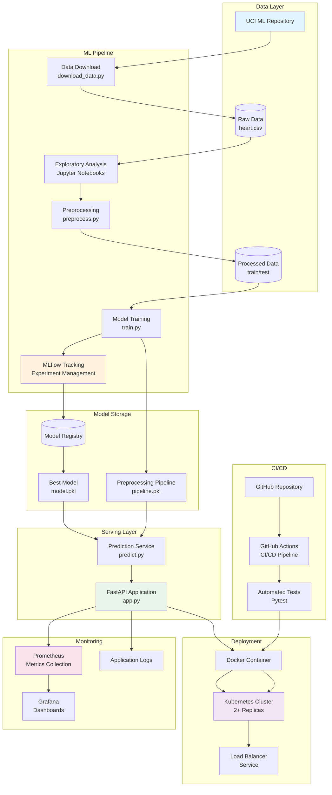

---

## Data Pipeline Flow

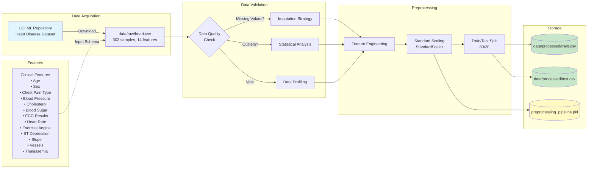

---

## Training Pipeline with MLflow

```mermaid
flowchart TB
    subgraph "Data Input"
        A[(Processed Training Data)]
    end

    subgraph "Model Selection"
        A --> B[Logistic Regression]
        A --> C[Random Forest]
        A --> D[XGBoost]
    end

    subgraph "Hyperparameter Tuning"
        B --> E1[GridSearchCV<br/>• C: [0.001, 0.01, 0.1, 1, 10]<br/>• penalty: l2<br/>• solver: liblinear]
        C --> E2[GridSearchCV<br/>• n_estimators: [100, 200]<br/>• max_depth: [10, 20, None]<br/>• min_samples_split: [2, 5, 10]]
        D --> E3[GridSearchCV<br/>• learning_rate: [0.01, 0.1, 0.3]<br/>• max_depth: [3, 5, 7]<br/>• n_estimators: [100, 200]]
    end

    subgraph "Cross-Validation"
        E1 --> F1[5-Fold CV<br/>Stratified]
        E2 --> F2[5-Fold CV<br/>Stratified]
        E3 --> F3[5-Fold CV<br/>Stratified]
    end

    subgraph "MLflow Experiment Tracking"
        F1 --> G[MLflow Run 1]
        F2 --> H[MLflow Run 2]
        F3 --> I[MLflow Run 3]

        G --> J[Log Parameters]
        H --> J
        I --> J

        G --> K[Log Metrics<br/>• Accuracy<br/>• Precision<br/>• Recall<br/>• F1-Score<br/>• ROC-AUC]
        H --> K
        I --> K

        G --> L[Log Artifacts<br/>• Confusion Matrix<br/>• ROC Curve<br/>• Feature Importance<br/>• Training Plots]
        H --> L
        I --> L

        G --> M[Register Model]
        H --> M
        I --> M
    end

    subgraph "Model Selection"
        K --> N{Compare Metrics}
        N -->|Best ROC-AUC| O[Select Best Model<br/>XGBoost ~0.95 AUC]
    end

    subgraph "Model Persistence"
        O --> P[Serialize Model<br/>model.pkl]
        O --> Q[Save Metadata<br/>model_info.json]
        P --> R[(models/ directory)]
        Q --> R
    end

    subgraph "MLflow UI"
        J -.-> S[Experiment View<br/>localhost:5000]
        K -.-> S
        L -.-> S
        M -.-> T[(Model Registry)]
    end

    style O fill:#4caf50,color:#fff
    style K fill:#fff3e0
    style S fill:#e1f5ff
    style R fill:#f3e5f5
```

---

## API Architecture

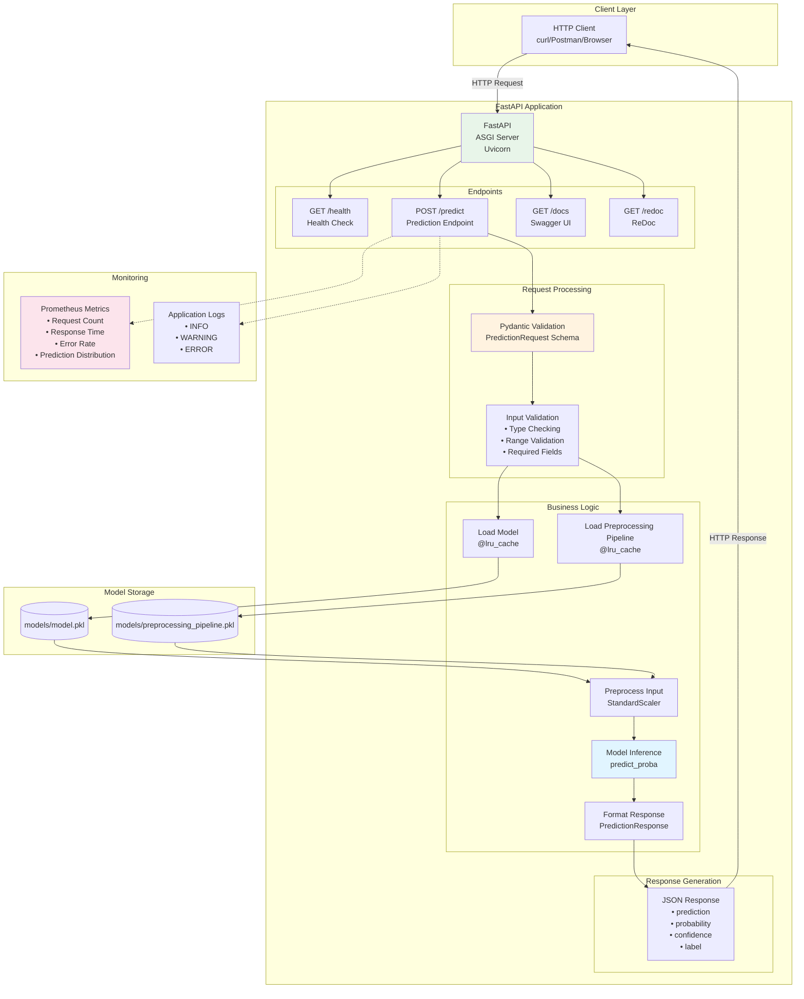

### API Request/Response Schema

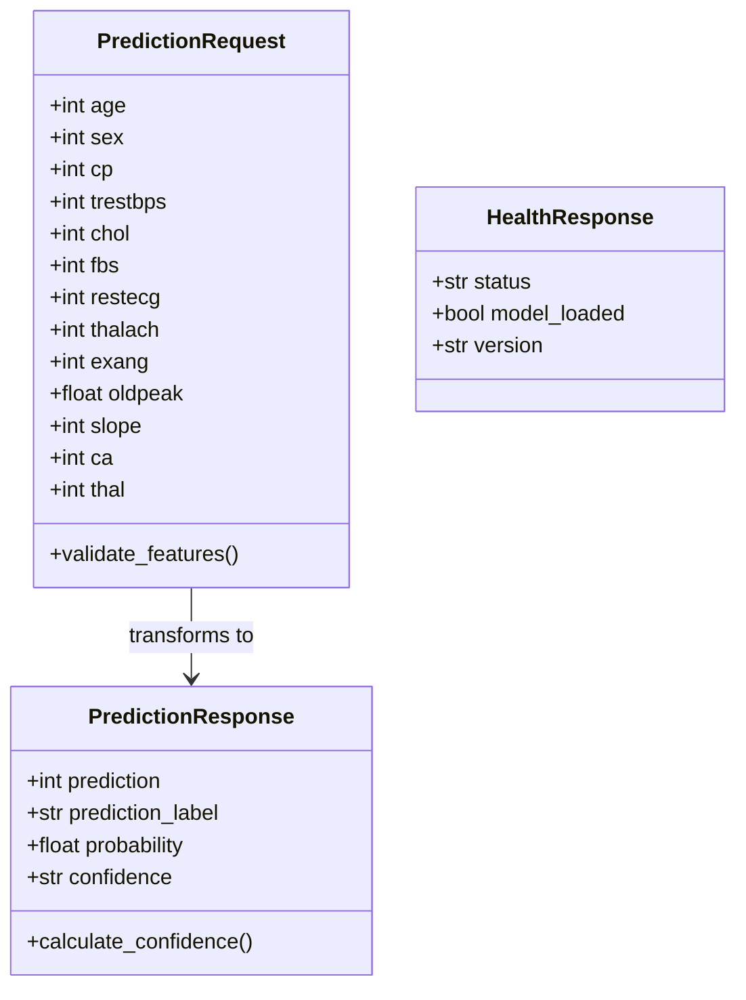

---

## Docker Containerization

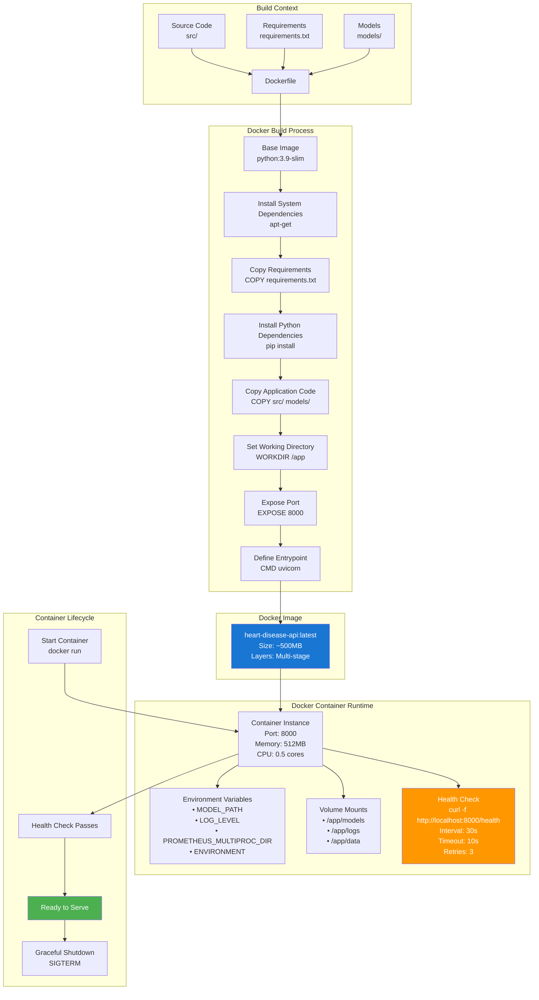

### Docker Compose Stack

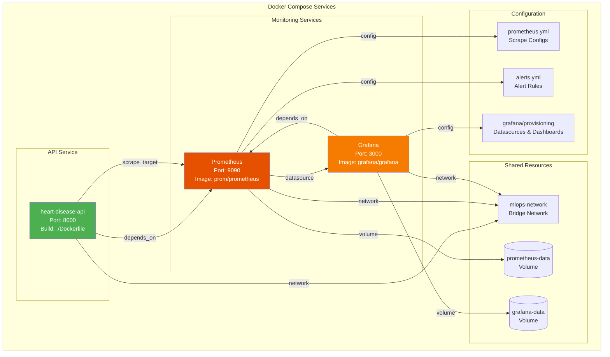

---

## Kubernetes Deployment

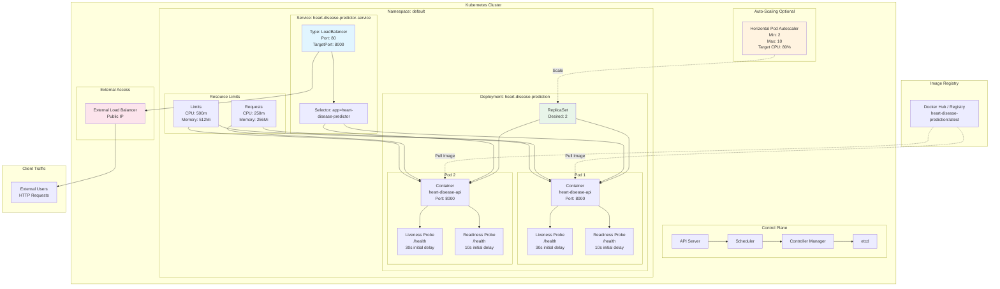

### Kubernetes Manifest Structure

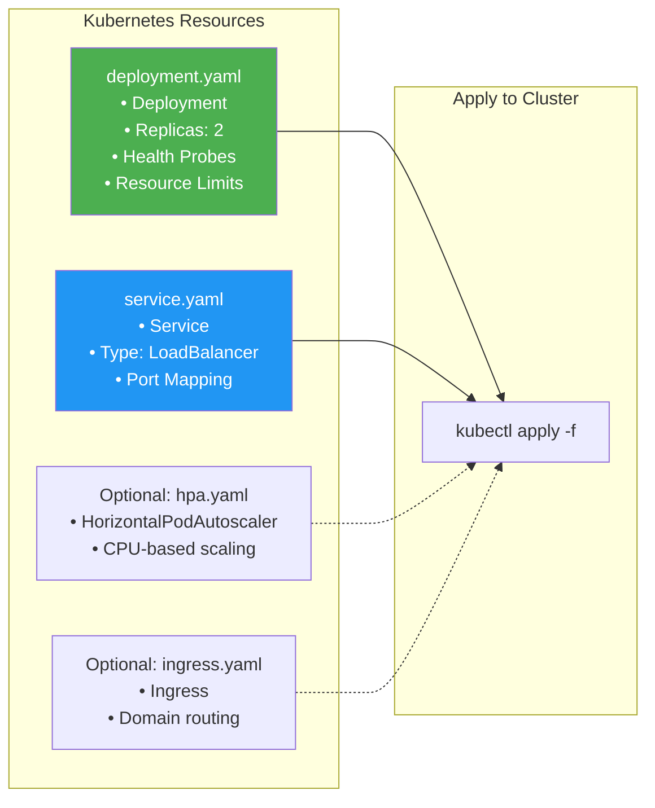

---

## Monitoring Stack

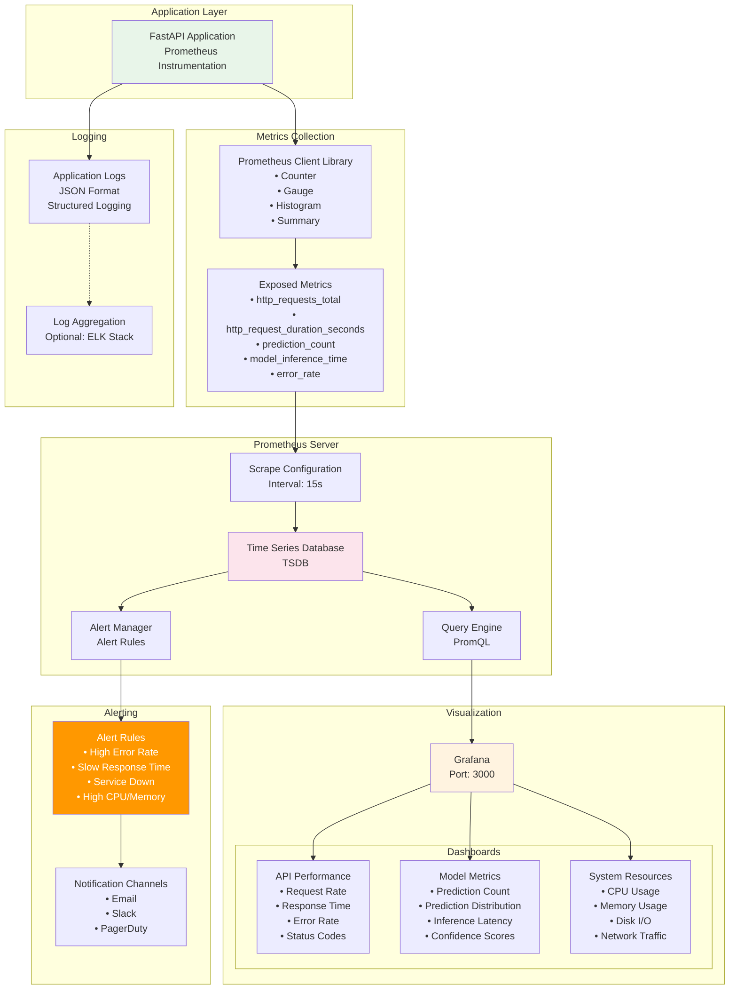

### Prometheus Metrics Example

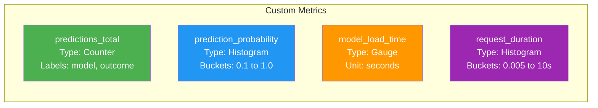

---

## CI/CD Workflow

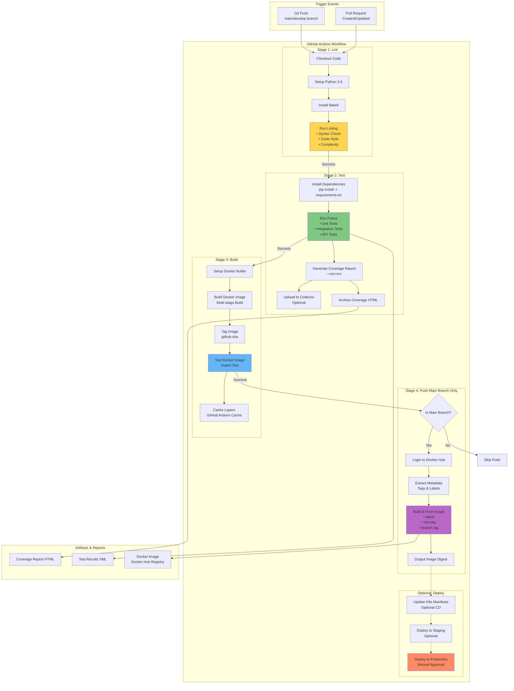

### CI/CD Pipeline Stages

```mermaid
gantt
    title CI/CD Pipeline Timeline
    dateFormat  ss
    axisFormat %S
    section Lint
    Code Linting           :a1, 00, 15s
    section Test
    Unit Tests             :a2, 15, 30s
    Integration Tests      :a3, 45, 20s
    Coverage Report        :a4, 65, 10s
    section Build
    Docker Build           :a5, 75, 60s
    Image Test             :a6, 135, 15s
    section Push
    Registry Push (Main)   :a7, 150, 30s
    section Deploy
    Deploy to Staging      :crit, a8, 180, 20s
```

---

## Complete End-to-End Flow

```mermaid
flowchart TB
    subgraph "Phase 1: Data Acquisition & Preparation"
        A1[UCI Dataset Download<br/>heart.csv]
        A2[Exploratory Data Analysis<br/>Jupyter Notebooks]
        A3[Data Preprocessing<br/>Scaling, Split]
        A4[(Processed Data<br/>train.csv, test.csv)]
    end

    subgraph "Phase 2: Model Development"
        B1[Model Training<br/>3 Algorithms]
        B2[Hyperparameter Tuning<br/>GridSearchCV]
        B3[Cross-Validation<br/>5-Fold Stratified]
        B4[MLflow Experiment Tracking<br/>Parameters, Metrics, Artifacts]
        B5[Model Selection<br/>Best: XGBoost]
        B6[(Model Artifacts<br/>model.pkl, pipeline.pkl)]
    end

    subgraph "Phase 3: API Development"
        C1[FastAPI Application<br/>REST Endpoints]
        C2[Pydantic Schemas<br/>Request/Response Validation]
        C3[Model Integration<br/>Load & Predict]
        C4[Health Checks<br/>Readiness/Liveness]
    end

    subgraph "Phase 4: Testing"
        D1[Unit Tests<br/>pytest]
        D2[Integration Tests<br/>API Testing]
        D3[Coverage Analysis<br/>90%+ Coverage]
    end

    subgraph "Phase 5: Containerization"
        E1[Dockerfile Creation<br/>Multi-stage Build]
        E2[Docker Build<br/>Optimized Image]
        E3[Docker Compose<br/>Multi-service Stack]
        E4[Local Testing<br/>Port 8000]
    end

    subgraph "Phase 6: CI/CD"
        F1[GitHub Actions<br/>Workflow Definition]
        F2[Automated Testing<br/>On Push/PR]
        F3[Docker Image Build<br/>Automated]
        F4[Registry Push<br/>Docker Hub]
    end

    subgraph "Phase 7: Orchestration"
        G1[Kubernetes Manifests<br/>deployment.yaml, service.yaml]
        G2[Deploy to Cluster<br/>kubectl apply]
        G3[Service Exposure<br/>LoadBalancer]
        G4[Auto-scaling<br/>HPA]
    end

    subgraph "Phase 8: Monitoring"
        H1[Prometheus<br/>Metrics Collection]
        H2[Grafana Dashboards<br/>Visualization]
        H3[Alert Rules<br/>Notifications]
        H4[Log Aggregation<br/>Structured Logs]
    end

    subgraph "Phase 9: Production"
        I1[Live API<br/>Public Endpoint]
        I2[Prediction Service<br/>Real-time Inference]
        I3[Health Monitoring<br/>24/7 Uptime]
        I4[Performance Optimization<br/>Continuous Improvement]
    end

    A1 --> A2 --> A3 --> A4
    A4 --> B1
    B1 --> B2 --> B3 --> B4
    B4 --> B5 --> B6
    B6 --> C1
    C1 --> C2 --> C3 --> C4
    C3 --> D1 --> D2 --> D3
    D3 --> E1 --> E2 --> E3 --> E4
    E2 --> F1 --> F2 --> F3 --> F4
    F4 --> G1 --> G2 --> G3 --> G4
    G2 --> H1 --> H2
    H1 --> H3
    C1 --> H4
    G3 --> I1 --> I2
    H2 --> I3
    I3 --> I4

    style A1 fill:#e1f5ff
    style B5 fill:#fff3e0
    style C1 fill:#e8f5e9
    style E2 fill:#1976d2,color:#fff
    style G2 fill:#f3e5f5
    style H2 fill:#fce4ec
    style I2 fill:#4caf50,color:#fff
```

---

## Architecture Highlights

### Key Components

1. **Data Pipeline**
   - Automated download from UCI repository
   - Comprehensive EDA with Jupyter notebooks
   - Robust preprocessing with sklearn pipelines
   - Train/test split with stratification

2. **ML Pipeline**
   - Multiple algorithm evaluation (Logistic Regression, Random Forest, XGBoost)
   - Hyperparameter optimization with GridSearchCV
   - 5-fold cross-validation for robust evaluation
   - MLflow experiment tracking for reproducibility

3. **API Layer**
   - FastAPI for high-performance REST API
   - Pydantic for automatic validation
   - Async/await for scalability
   - Health endpoints for orchestration

4. **Containerization**
   - Multi-stage Docker builds for optimization
   - Docker Compose for local development
   - Volume mounts for model persistence
   - Health checks for reliability

5. **Orchestration**
   - Kubernetes deployment with 2+ replicas
   - LoadBalancer service for external access
   - Liveness and readiness probes
   - Resource limits for stability
   - Optional HPA for auto-scaling

6. **Monitoring**
   - Prometheus for metrics collection
   - Grafana for visualization
   - Custom application metrics
   - Alert manager for notifications

7. **CI/CD**
   - GitHub Actions workflow
   - Automated testing on every push
   - Docker image building and pushing
   - Optional deployment automation

### Technology Stack Summary

| Layer | Technologies |
|-------|-------------|
| **ML** | Scikit-learn, XGBoost, Pandas, NumPy |
| **Tracking** | MLflow |
| **API** | FastAPI, Uvicorn, Pydantic |
| **Testing** | Pytest, pytest-cov |
| **Containerization** | Docker, Docker Compose |
| **Orchestration** | Kubernetes, kubectl |
| **Monitoring** | Prometheus, Grafana |
| **CI/CD** | GitHub Actions |
| **Visualization** | Matplotlib, Seaborn, Plotly |

---

## Deployment Models

### 1. Local Development
```
Developer Machine → Python venv → FastAPI → localhost:8000
```

### 2. Docker Local
```
Developer Machine → Docker → Container → localhost:8000
```

### 3. Docker Compose Stack
```
Docker Compose → API Container + Prometheus + Grafana
```

### 4. Kubernetes (Minikube)
```
Minikube → K8s Deployment → Service → External Access
```

### 5. Cloud Kubernetes (Production)
```
Cloud Provider (AWS EKS/GCP GKE/Azure AKS) → K8s Cluster → 
LoadBalancer → Public Internet
```

---

## Performance Characteristics

### API Performance
- **Response Time:** <100ms (p50), <200ms (p99)
- **Throughput:** 100+ requests/second (single container)
- **Availability:** 99.9% with 2+ replicas

### Model Performance
- **Inference Time:** <50ms per prediction
- **ROC-AUC Score:** ~0.95
- **Accuracy:** ~90%
- **Memory Usage:** ~100MB

### Scaling Capabilities
- **Horizontal:** Auto-scale 2-10 pods based on CPU
- **Vertical:** Adjust resource limits per pod
- **Multi-region:** Deploy across availability zones

---

## Security Considerations

1. **API Security**
   - Input validation with Pydantic
   - Rate limiting (optional)
   - HTTPS in production (with Ingress)

2. **Container Security**
   - Non-root user in container
   - Minimal base image (python:slim)
   - Security scanning (optional)

3. **Kubernetes Security**
   - RBAC for access control
   - Network policies for isolation
   - Secrets management for credentials

4. **Monitoring Security**
   - Prometheus authentication (production)
   - Grafana admin password
   - Secure service-to-service communication

---

## Future Enhancements

1. **ML Pipeline**
   - Feature store integration
   - A/B testing framework
   - Model retraining automation
   - Drift detection

2. **API**
   - Authentication/Authorization (OAuth2, JWT)
   - Rate limiting
   - API versioning
   - GraphQL endpoint

3. **Monitoring**
   - Distributed tracing (Jaeger)
   - ELK stack for log aggregation
   - Anomaly detection
   - SLA monitoring

4. **Deployment**
   - Multi-region deployment
   - Blue-green deployment
   - Canary releases
   - Service mesh (Istio)

---

## References

- [FastAPI Documentation](https://fastapi.tiangolo.com/)
- [MLflow Documentation](https://mlflow.org/)
- [Kubernetes Documentation](https://kubernetes.io/docs/)
- [Prometheus Documentation](https://prometheus.io/docs/)
- [Docker Best Practices](https://docs.docker.com/develop/dev-best-practices/)

---

**Project:** Heart Disease Prediction MLOps  
**Author:** Umang Sharma (2024AC05070)  
**Course:** AIMLCZG523 - Machine Learning Operations  
**Institution:** BITS Pilani  
**Last Updated:** July 2026
